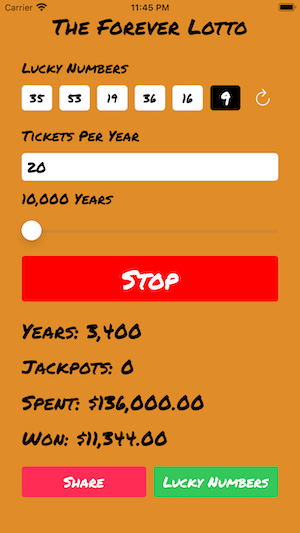

# The Forever Lotto

This is an app that lets you simulate playing the lottery up to a million years.  It was built with the storyboard and has a table view in it. It uses Aysnc Queues and functon programming.  It also contains a few tests as well.

## Promo Video

<iframe width="560" height="315" src="https://www.youtube.com/embed/2Th-rFvACgE" title="YouTube video player" frameborder="0" allow="accelerometer; autoplay; clipboard-write; encrypted-media; gyroscope; picture-in-picture" allowfullscreen></iframe>

## Screenshots

